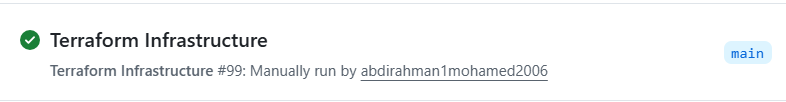
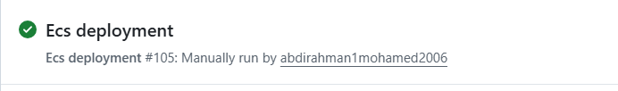

# Blue-Green-Deployment-ECS: URL Shortener Platform

A **production-grade URL shortener service** deployed on AWS ECS Fargate with infrastructure-as-code provisioning via Terraform and secure, automated blue-green deployments through GitHub Actions and AWS CodeDeploy.

## Overview

This project demonstrates enterprise-grade cloud infrastructure practices by building a scalable URL shortening service that showcases:
- **Secure OIDC-based deployments** without static AWS credentials
- **Blue-green deployment strategy** for zero-downtime updates
- **Flexible data backends** supporting both DynamoDB and PostgreSQL
- **Event-driven analytics** through SQS integration
- **Infrastructure-as-Code** using modular Terraform
- **Security hardening** with AWS WAF, ACM TLS termination, and least-privilege IAM
- **Cost optimization** through VPC endpoints and no NAT gateways

---

## Key AWS Services

| Service | Purpose |
|---------|---------|
| **ECS Fargate** | Containerized application hosting (serverless containers) |
| **Application Load Balancer** | Layer 7 routing with health checks |
| **AWS Certificate Manager** | TLS certificate management |
| **Route 53** | DNS routing and domain management |
| **DynamoDB / RDS** | URL mapping storage |
| **SQS** | Asynchronous analytics event queue |
| **CodeDeploy** | Blue-green deployment orchestration |
| **IAM + OIDC** | Secure, temporary credential management |
| **AWS WAF** | Web application firewall protection |
| **VPC Endpoints** | Private AWS service access without NAT |

---

## Features

### URL Shortening API
- **POST `/shorten`** - Generate short URLs with SHA256-based IDs
- **GET `/{short_id}`** - Redirect to original URL with click tracking
- **GET `/stats/{short_id}`** - View click statistics for shortened URLs
- **GET `/healthz`** - Health check endpoint


## Prerequisites

### AWS Requirements
- AWS Account with permissions across: IAM, ECR, ECS, ALB, ACM, Route 53, DynamoDB, CodeDeploy, SQS
- A **public domain name** and corresponding **Route 53 hosted zone** for DNS validation and traffic routing
- Sufficient AWS service quotas (ECS tasks, ALB targets, etc.)

### GitHub Requirements
- GitHub repository with GitHub Actions enabled
- Must create the following **repository secret**:
  - `AWS_ROLE_ARN` - ARN of the IAM role that trusts GitHub OIDC (created during bootstrap)

### Local Development
- Terraform (v1.0+)
- AWS CLI configured with appropriate credentials
- Docker (for building and testing images locally)
- Python 3.12+ (for local FastAPI development)

---

## Setup Instructions

### 1. Bootstrap AWS Infrastructure

The bootstrap phase creates foundational resources that enable the remaining infrastructure:

```bash
cd bootstrap
terraform init
terraform plan
terraform apply
```

**Resources created:**
- S3 bucket for Terraform state management
- ECR repository for container images
- IAM role that trusts GitHub OIDC
- Certificates and Route 53 hosted zone validation

### 2. Add GitHub Repository Secret

After bootstrap completes, retrieve the IAM role ARN from Terraform outputs and add it as a repository secret:

```bash
# In GitHub UI: Settings → Secrets and variables → Actions
# Add secret: AWS_ROLE_ARN = <value from terraform output>
```

### 3. Deploy Core Infrastructure

Deploy the main Terraform configuration to create the complete AWS infrastructure:

```bash
cd Terraform
terraform init
terraform plan -out=tfplan
terraform apply tfplan
```

**Resources created:**
- VPC with public/private subnets
- ALB with health checks
- ECS Fargate cluster
- DynamoDB table for URL mappings
- SQS queue for analytics
- CloudWatch logging
- WAF rules
- Route 53 DNS records

### 4. Trigger Deployment

Push code to trigger the GitHub Actions workflows:

```bash
git add .
git commit -m "Deploy URL shortener"
git push origin main
```

**Workflow execution:**
1. **Docker workflow** builds image and runs Trivy security scan
2. **Terraform workflow** validates and deploys infrastructure
3. **Deploy workflow** registers ECS task definition and initiates blue-green deployment via CodeDeploy

---

## CI/CD Pipeline

### GitHub Actions Workflows

#### `.github/workflows/docker.yaml` - Container Build & Scan
- Builds Docker image from multistage Dockerfile
- Runs Trivy vulnerability scanning
- Pushes image to ECR with git tag and `latest` labels

#### `.github/workflows/terraform.yaml` - Infrastructure Provisioning
- Runs `terraform plan` and `terraform apply`
- Uses GitHub OIDC for secure AWS credential exchange
- Validates configuration without static credentials

#### `.github/workflows/ci.yaml` - Continuous Integration
- Runs Python tests (API and database tests)
- Validates code quality and dependencies
- Ensures application readiness

#### `.github/workflows/destroy.yaml` - Infrastructure Teardown
- Safely destroys Terraform-managed resources
- Manual trigger only for environment cleanup

### Deployment Flow

```
Code Push
  ↓
Docker Build + Trivy Scan
  ↓
Push to ECR (tag: git-tag or 'latest')
  ↓
Register New ECS Task Definition
  ↓
Update appspec.yaml with Task Definition ARN
  ↓
Trigger CodeDeploy Blue-Green Deployment
  ├─ Validate Green Environment
  ├─ Health Check (waits for success)
  ├─ Route traffic to Green
  └─ Terminate Blue (or keep for quick rollback)
  ↓
Monitor CloudWatch Logs
```

---

## Repository Structure

```
.
├── README.md                          # Documentation (this file)
├── requirements.txt                   # Python dependencies
├── appspec.yaml                       # CodeDeploy configuration
│
├── .github/workflows/                 # CI/CD automation
│   ├── docker.yaml                    # Container build & scan
│   ├── terraform.yaml                 # Infrastructure deployment
│   ├── ci.yaml                        # Testing & validation
│   └── destroy.yaml                   # Infrastructure cleanup
│
├── bootstrap/                         # One-time AWS setup
│   ├── backend.tf                     # S3 state backend
│   ├── main.tf                        # Bootstrap resources
│   ├── provider.tf                    # AWS provider config
│   ├── output.tf                      # Output values (IAM role ARN)
│   └── variable.tf                    # Input variables
│
├── Terraform/                         # Main infrastructure code
│   ├── backend.tf                     # Remote state configuration
│   ├── main.tf                        # Core resources & module calls
│   ├── variable.tf                    # Environment variables
│   └── modules/                       # Modular Terraform components
│       ├── VPC/                       # Networking: subnets, route tables
│       ├── ALB/                       # Load balancer & target groups
│       ├── ECS/                       # Fargate cluster & services
│       ├── IAM/                       # Roles & policies
│       ├── ACM/                       # TLS certificates
│       ├── Route53/                   # DNS configuration
│       ├── CodeDeploy/                # Deployment configuration
│       └── WAF/                       # Web application firewall
│
├── url-shortener/app/                 # FastAPI Application
│   ├── Dockerfile                     # Multistage container image
│   ├── docker-compose.yaml            # Local development setup
│   └── src/                           # Application source code
│
└── services/                          # Additional microservices
    ├── dashboard/                     # Analytics dashboard (Go)
    └── worker/                        # Event processing worker (Go)
```

---

## API Documentation

### Endpoints

#### Health Check
```http
GET /healthz
Response: {"status": "ok"}
```

#### Create Shortened URL
```http
POST /shorten
Content-Type: application/json

Request Body:
{
  "url": "https://example.com/very/long/path?query=params"
}

Response:
{
  "short": "a1b2c3d4",
  "url": "https://example.com/very/long/path?query=params",
  "short_url": "https://yourdomain.com/a1b2c3d4"
}
```

#### Resolve Short URL (with tracking)
```http
GET /{short_id}

Response: 301 Redirect to original URL
Headers: Location: https://original-url.com
Side Effects: 
  - Increments click count in database
  - Publishes SQS event for analytics
```

#### View Statistics
```http
GET /stats/{short_id}

Response:
{
  "short": "a1b2c3d4",
  "url": "https://example.com/very/long/path",
  "clicks": 42
}
```

---

## Environment Variables

### Application Configuration
| Variable | Purpose | Default |
|----------|---------|---------|
| `TABLE_NAME` | DynamoDB table name for URL mappings | Required if `DATABASE_URL` not set |
| `DATABASE_URL` | PostgreSQL connection string | Optional (DynamoDB preferred if not set) |
| `SQS_QUEUE_URL` | SQS queue URL for analytics events | Optional (events logged locally if not set) |
| `BASE_URL` | Base URL for shortened links | Optional (e.g., `https://yourdomain.com`) |

### AWS Configuration (Set by CI/CD)
```bash
AWS_ROLE_ARN              # GitHub OIDC role ARN
AWS_REGION               # AWS region (e.g., us-east-1)
```

---

## Local Development

### Run with Docker Compose
```bash
cd url-shortener/app
docker-compose up
```

Accesses local DynamoDB via LocalStack for development.

### Run Tests
```bash
cd url-shortener/app
pytest tests/
```

Tests cover:
- URL shortening API logic
- DynamoDB operations
- Request/response validation

### Manual Testing
```bash
# Create shortened URL
curl -X POST http://localhost:5320/shorten \
  -H "Content-Type: application/json" \
  -d '{"url":"https://github.com"}'

# Resolve URL
curl -L http://localhost:5320/a1b2c3d4

# View stats
curl http://localhost:5320/stats/a1b2c3d4

# Health check
curl http://localhost:5320/healthz
```

---

## Security Considerations

### OIDC & Credential Management
- No static AWS credentials stored in repository
- GitHub OIDC provider exchanges time-limited tokens for temporary AWS credentials
- Credentials are automatically revoked after workflow completion

### IAM Policies
- Least-privilege principle: each service/role has minimal required permissions
- Separate roles for CodeDeploy, ECS, GitHub Actions
- No overly permissive policies

### Network Security
- All services run in private subnets
- VPC endpoints provide private AWS service access
- No NAT gateways (cost optimization + reduced attack surface)
- ALB in public subnet handles ingress traffic
- Security groups restrict traffic between layers

### Data Protection
- TLS 1.2+ enforced at ALB (ACM certificates)
- DynamoDB encryption at rest
- SQS server-side encryption enabled

### Container Security
- Multistage Docker builds minimize image size and attack surface
- Non-root user (`appuser`) runs application
- Trivy scanning detects vulnerabilities before deployment

---

## Monitoring & Troubleshooting

### CloudWatch Logs
- ECS task logs: CloudWatch Logs group `/ecs/url-shortener`
- ALB access logs (if enabled): S3 bucket
- View via AWS Console or AWS CLI:
```bash
aws logs tail /ecs/url-shortener --follow
```

### Common Issues

**Blue-green deployment fails:**
- Check ECS task logs for startup errors
- Verify health check endpoint (`/healthz`) responds with 200 OK
- Ensure environment variables are correctly set in task definition
- Check IAM role permissions for CodeDeploy

**URL shortening fails:**
- Verify DynamoDB table name matches `TABLE_NAME` env var
- Check IAM role has DynamoDB permissions
- View CloudWatch logs for specific error messages
- Ensure SQS queue URL is correctly configured if analytics are enabled

**ALB returning 502/503:**
- Confirm ECS tasks are running: `aws ecs list-tasks --cluster url-shortener`
- Check target health in ALB console
- Verify security group rules allow traffic from ALB to ECS tasks
- Review CloudWatch logs for application errors

---

## Deployment Success Showcase

### GitHub Workflow Runs

)





---

### Infrastructure Components

#### Target Group (ALB)

![Target Group Configuration] (c:\Users\samue\OneDrive\Pictures\ECSV2\Screenshot 2026-05-17 113610.png)

---

#### VPC Endpoints


---

#### CodeDeploy Deployment Success


---

#### OIDC Credentials & GitHub Integration


